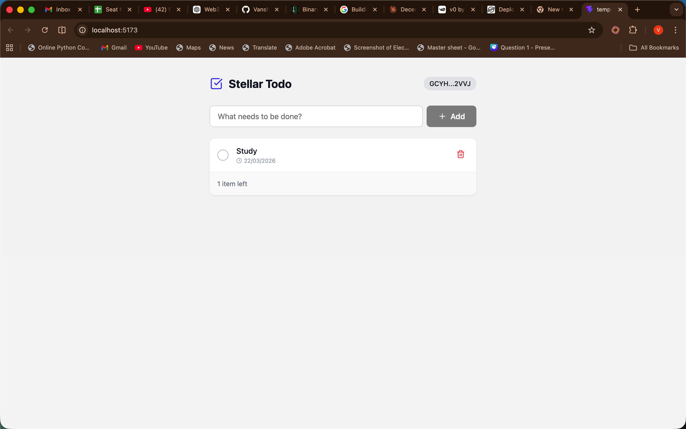
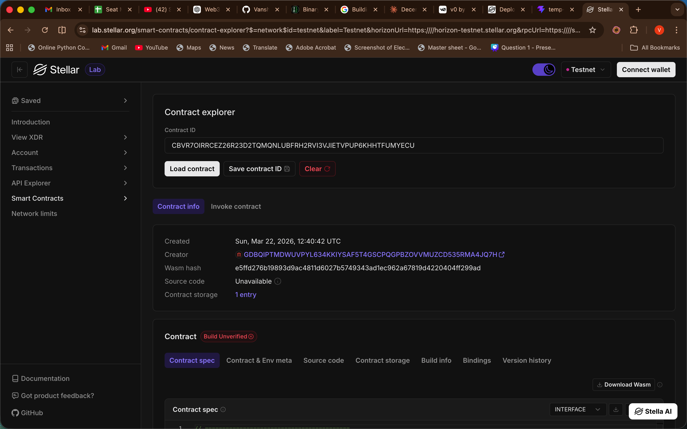

# OnChainTodoList

A decentralized Todo List built on the **Stellar Soroban** smart contract network.

## Live Deployment

The smart contract has been heavily optimized and deployed on the Stellar **Testnet**. 

- **Contract Address:** `CBVR7OIRRCEZ26R23D2TQMQNLUBFRH2RVI3VJIETVPUP6KHHTFUMYECU`

## Application Previews

### Dashboard Preview
A look into the frontend dashboard interacting with the smart contract:

### Stellar Labs Transaction
Interaction logged directly on Stellar Labs showing the deployment / invocation trace:

---
*Built with [Soroban SDK](https://soroban.stellar.org/docs) and [React](https://reactjs.org/).*
